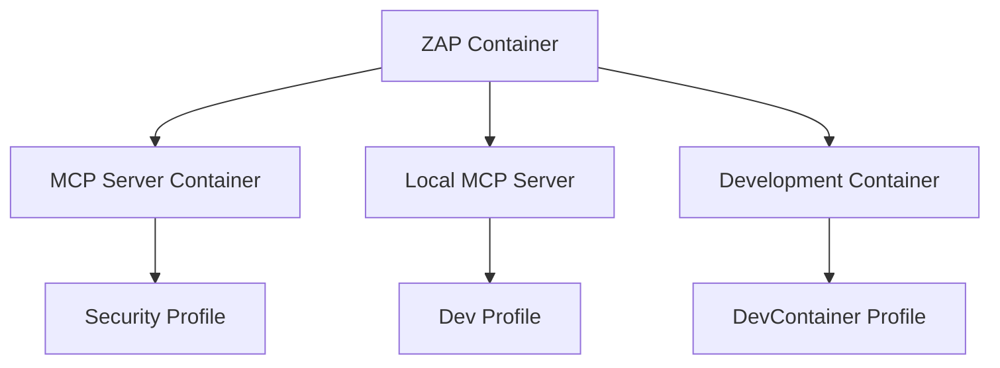

# Docker Configuration and Profiles

This document provides comprehensive information about Docker setup, profiles, and configuration for the OWASP ZAP MCP project.

## 🎯 **Overview**

The OWASP ZAP MCP project uses Docker Compose with multiple profiles to support different workflows:

- **Security Engineers**: Ready-to-use scanning capabilities
- **Developers**: Multiple development environments
- **CI/CD**: Automated build and test workflows

## 📋 **Available Profiles**

### 🔒 **Production/Security Profiles**

#### `security` Profile (Default)
```bash
./scripts/start.sh --type image
# or
docker compose --profile security up -d
```

**Purpose**: Production-ready security scanning environment

**Components**:
- **ZAP**: `zaproxy/zap-stable:latest` container
- **MCP Server**: Pre-built `owasp-zap-mcp-image` container
- **Network**: Isolated `zap-network`

**Use Cases**:
- Security engineers performing scans
- Production deployments
- CI/CD pipelines
- Quick security assessments

**URLs**:
- ZAP API: http://localhost:8080
- ZAP Web UI: http://localhost:8090
- MCP Server: http://localhost:3000

#### `services` Profile
```bash
docker compose --profile services up -d
```

**Purpose**: Alternative name for security profile (legacy compatibility)

**Note**: Functionally identical to `security` profile

### 🛠️ **Development Profiles**

#### `build-dev` Profile
```bash
./scripts/start.sh --type build
# or
docker compose --profile build-dev up -d
```

**Purpose**: Test builds from source code

**Components**:
- **ZAP**: `zaproxy/zap-stable:latest` container
- **MCP Server**: Built from source using `Dockerfile`
- **Network**: Isolated `zap-network`

**Use Cases**:
- Testing code changes
- Container build validation
- Development integration testing

#### `dev` Profile
```bash
./scripts/start.sh --type dev
# or
docker compose --profile dev up -d
```

**Purpose**: Local development with containerized ZAP

**Components**:
- **ZAP**: `zaproxy/zap-stable:latest` container
- **Dev Container**: Python development environment
- **Note**: MCP server runs locally, not in container

**Use Cases**:
- Active development work
- Testing changes quickly
- Debugging and profiling

**Workflow**:
```bash
# Start ZAP
./scripts/start.sh --type dev

# Run MCP server locally
cd owasp_zap_mcp && python -m owasp_zap_mcp.main --sse
```

#### `devcontainer` Profile
```bash
./scripts/start.sh --type devcontainer
# or
docker compose --profile devcontainer up -d
```

**Purpose**: Full container development environment

**Components**:
- **ZAP**: `zaproxy/zap-stable:latest` container
- **Dev Container**: Full development environment with VS Code support
- **Network**: Access to both container and host networks

**Use Cases**:
- VS Code Dev Container development
- Consistent development environment
- Container-based workflows

**Workflow**:
```bash
# Start containers
./scripts/start.sh --type devcontainer

# Attach to development container
docker exec -it owasp-zap-mcp-devcontainer bash
```

## 🏗️ **Container Architecture**

### **Network Configuration**

All profiles use the `zap-network` bridge network for container communication:

```yaml
networks:
  zap-network:
    driver: bridge
```

### **Service Dependencies**



### **Volume Mounts**

| Profile | Source | Target | Purpose |
|---------|--------|--------|---------|
| `dev` | `./owasp_zap_mcp` | `/workspace/owasp_zap_mcp` | Source code access |
| `devcontainer` | `./` | `/workspace` | Full project access |
| `devcontainer` | `/var/run/docker.sock` | `/var/run/docker.sock` | Docker socket access |

## ⚙️ **Environment Configuration**

### **Required Environment Variables**

Create `.env` file from `.env.example`:

```bash
# ZAP Configuration
ZAP_BASE_URL=http://zap:8080  # Container communication
ZAP_API_KEY=                  # Empty for no auth
ZAP_PORT=8080

# MCP Server Configuration
SERVER_HOST=0.0.0.0
SERVER_PORT=3000
LOG_LEVEL=INFO

# Platform Configuration
DOCKER_DEFAULT_PLATFORM=linux/amd64  # For ARM64 compatibility
```

### **Development vs Production Settings**

#### Development (Local MCP Server)
```bash
ZAP_BASE_URL=http://localhost:8080  # Direct host access
```

#### Production (Container Communication)
```bash
ZAP_BASE_URL=http://zap:8080  # Container-to-container
```

## 🚀 **Platform Support**

### **ARM64 Compatibility**

The project supports Apple Silicon Macs with platform specification:

```yaml
services:
  zap:
    platform: linux/amd64  # Forces amd64 on ARM64 hosts
    environment:
      - JAVA_OPTS=-Xmx1g -XX:+UseContainerSupport
```

### **Performance Optimization**

- **Java Memory**: Configured for container limits
- **Docker BuildKit**: Enabled for faster builds
- **Multi-stage Builds**: Optimized image sizes

## 🔧 **Service Configuration**

### **ZAP Container**

```yaml
services:
  zap:
    image: zaproxy/zap-stable:latest
    platform: linux/amd64
    container_name: zap
    ports:
      - "8080:8080"  # API port
      - "8090:8090"  # Web UI port
    command: >
      zap.sh -daemon -host 0.0.0.0 -port 8080
      -config api.addrs.addr.name=.*
      -config api.addrs.addr.regex=true
      -config api.disablekey=true
    environment:
      - JAVA_OPTS=-Xmx1g -XX:+UseContainerSupport
    healthcheck:
      test: ["CMD", "curl", "-f", "http://localhost:8080/JSON/core/view/version/"]
      interval: 30s
      timeout: 10s
      retries: 5
      start_period: 60s
```

### **MCP Server Container (Security Profile)**

```yaml
owasp-zap-mcp-image:
  image: ghcr.io/ashmere/owasp-zap-mcp:latest
  container_name: owasp-zap-mcp-image
  ports:
    - "3000:3000"
  environment:
    - ZAP_BASE_URL=http://zap:8080
    - SERVER_HOST=0.0.0.0
    - SERVER_PORT=3000
  depends_on:
    zap:
      condition: service_healthy
```

### **MCP Server Container (Build Profile)**

```yaml
owasp-zap-mcp-build:
  build:
    context: ./owasp_zap_mcp
    dockerfile: Dockerfile
  container_name: owasp-zap-mcp-build
  ports:
    - "3000:3000"
  environment:
    - ZAP_BASE_URL=http://zap:8080
  depends_on:
    zap:
      condition: service_healthy
```

## 📊 **Health Checks**

### **ZAP Health Check**

```bash
# Container health check
curl -f http://localhost:8080/JSON/core/view/version/

# Expected response
{"version":"2.16.1"}
```

### **MCP Server Health Check**

```bash
# Server health
curl http://localhost:3000/health

# Server status
curl http://localhost:3000/status

# Expected: JSON response with status information
```

## 🔍 **Troubleshooting**

### **Common Issues**

#### Port Conflicts
```bash
# Check port usage
lsof -i :8080 -i :3000 -i :8090

# Kill conflicting processes
sudo lsof -ti:8080 | xargs kill -9
```

#### ARM64 Platform Issues
```bash
# Force rebuild with correct platform
docker compose build --no-cache --platform linux/amd64

# Check platform
docker compose config | grep platform
```

#### Container Communication
```bash
# Test ZAP from MCP container
docker exec owasp-zap-mcp-image curl http://zap:8080/JSON/core/view/version/

# Check network connectivity
docker network inspect owasp-zap-mcp_zap-network
```

#### Java Memory Issues
```bash
# Check Java options in ZAP container
docker exec zap ps aux | grep java

# Monitor memory usage
docker stats zap
```

### **Debug Commands**

#### Container Status
```bash
# List all containers
docker compose ps

# Check specific profile
docker compose --profile security ps
docker compose --profile build-dev ps

# Container logs
docker compose logs -f zap
docker compose logs -f owasp-zap-mcp-image
```

#### Network Debugging
```bash
# Inspect network
docker network ls
docker network inspect owasp-zap-mcp_zap-network

# Container network info
docker inspect zap --format='{{range .NetworkSettings.Networks}}{{.IPAddress}}{{end}}'
```

#### Health Check Status
```bash
# Check health status
docker compose ps --format "table {{.Name}}\t{{.Status}}\t{{.Ports}}"

# Manual health check
docker exec zap curl -f http://localhost:8080/JSON/core/view/version/
```

## 🧹 **Maintenance Commands**

### **Cleanup**

```bash
# Stop all services
./scripts/stop.sh

# Remove containers and volumes
docker compose down -v --remove-orphans

# Clean up images
docker system prune -f

# Full cleanup (removes images)
docker compose down --rmi all -v --remove-orphans
```

### **Updates**

```bash
# Pull latest images
docker compose pull

# Rebuild with latest base images
docker compose build --no-cache --pull

# Update and restart
./scripts/rebuild.sh
```

## 🏷️ **Image Management**

### **Available Images**

| Image | Purpose | Source |
|-------|---------|--------|
| `zaproxy/zap-stable:latest` | ZAP Scanner | Docker Hub (official) |
| `ghcr.io/ashmere/owasp-zap-mcp:latest` | MCP Server | GitHub Container Registry |
| Local build | Development | Built from source |

### **Build Process**

```bash
# Build development image
docker compose build owasp-zap-mcp-build

# Build with no cache
docker compose build --no-cache owasp-zap-mcp-build

# Multi-platform build (if needed)
docker buildx build --platform linux/amd64,linux/arm64 .
```

## 📈 **Performance Tuning**

### **Resource Limits**

Recommended resource allocation:

- **ZAP Container**: 1-2 GB RAM, 1-2 CPU cores
- **MCP Server**: 512 MB RAM, 0.5 CPU cores
- **Development Container**: 1 GB RAM, 1 CPU core

### **Optimization Tips**

1. **Use image profile for production**: Pre-built images are faster
2. **Local development**: Use dev profile for faster iteration
3. **Resource monitoring**: Use `docker stats` to monitor usage
4. **Clean builds**: Use `--no-cache` when debugging build issues

## 🔐 **Security Considerations**

### **Network Security**

- **Isolated Network**: All containers use dedicated `zap-network`
- **No Host Network**: Containers don't use host networking
- **Port Exposure**: Only necessary ports exposed to host

### **Container Security**

- **No Root User**: MCP server runs as non-root user
- **Read-only Filesystem**: Where possible, use read-only mounts
- **Minimal Images**: Based on slim Python images

### **API Security**

- **ZAP API Key**: Disabled for internal container communication
- **Host Access**: ZAP web UI accessible only on localhost
- **MCP Server**: No authentication (internal network only)

---

For more information, see:
- [Scripts Documentation](scripts.md)
- [Development Tips](development-tips.ai.md)
- [Main README](../README.md) 
